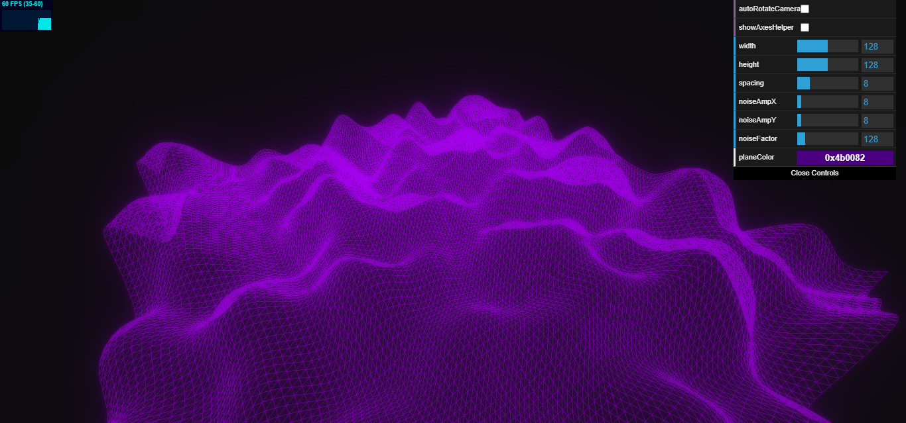

# Neon World
> Terrain mesh generation using Peril Noise 2D function.

## Table of contents
- [Neon World](#neon-world)
  - [Table of contents](#table-of-contents)
  - [General info](#general-info)
  - [Demo](#demo)
  - [Screenshots](#screenshots)
  - [Technologies](#technologies)
  - [Setup and run](#setup-and-run)
  - [Features](#features)
  - [Issues](#issues)
  - [Status](#status)
  - [Inspiration](#inspiration)
  - [Contact](#contact)

## General info
Main goal of this project was to learn about terrain generation using noise function. Besides, I also wanted to create eye-catching, fancy mesh-based visualization.

## Demo
Project is avaible online on Github Pages [here](https://michaltkacz.github.io/neon-world/).

## Screenshots

## Technologies
* [Three.js](https://threejs.org/ "Three.js webpage") library (project developed under version: [r125](https://github.com/mrdoob/three.js/releases "Three.js version changelog")).
* [stats.js](https://github.com/mrdoob/stats.js/ "stats.js github page") library.

## Setup and run
To run it locally, just download repository and launch `index.html` on local server. Web browser must support WebGL. In case you don't know whether your browser supports WebGL or not, you can check it [here](https://get.webgl.org/).

## Features
List of features:
* Terrarin generation using Perlin noise 2D function.
* Mouse interaction with camera.
* A list of nine settings to play with.

| Setting          | Value Range    | Description                                 |
| ---------------- | -------------- | ------------------------------------------- |
| autoRotateCamera | bool           | Enable/disable automatic camera rotation    |
| showAxesHelper   | bool           | Show/hide axes helper                       |
| width            | 2-256          | Width of mesh                               |
| height           | 2-256          | Height of mesh                              |
| spacing          | 2-32           | Mesh cell size                              |
| noiseAmpX        | 0-128          | 2D Perlin noise X amplification value       |
| noiseAmpY        | 0-128          | 2D Perlin noise Y amplification value       |
| noiseFactor      | 0-1024         | 2D Perlin noise general value amplification |
| planeColor       | RGB Hex values | Color of the mesh                           |

To-do ideas:
* Add more variations of mesh shape (e.g. oval, triangle, pentagon, hexagon, etc.).
* Adjust setting range values to achieve more interesting results.
* Add animations (i.e. mesh alters with the flow of time).

## Issues
Main issue is quite heavy performance drop, which occurs while changing settings. It is caused by rebuilding whole plane many times in very short time. Adding, for example, max number of rebuilds per second limit seems to be the simplest (not nessecery the most reliable) solution to fix this problem.

## Status
Altough there are interesting features that might be added, this project is no longer developed.

## Inspiration
Project inspired by [@shiffman](https://github.com/shiffman) ["Coding Challenge #11: 3D Terrain Generation with Perlin Noise in Processing"](https://www.youtube.com/watch?v=IKB1hWWedMk "Youtube video")

## Contact
Created by [@michaltkacz](https://github.com/michaltkacz) - feel free to contact me!